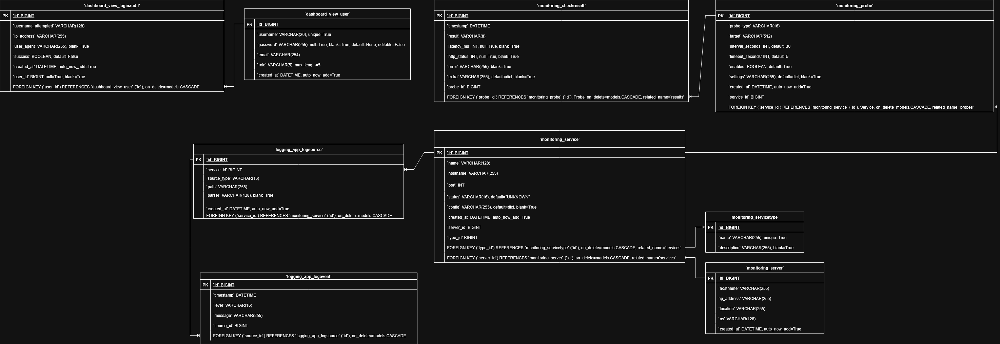

This project aims to create a service status dashboard for the servers I already host (Apache Webserver, ESXI, Minecraft, Pterodactyl). This will allow me to view their status and logs from a centralized locations

 

Currently, I have added a login screen, log view screen, and dashboard screen.
The login screen is currently static, as I have not learned how to properly manage users yet.
The log view screen currently just shows all the logs that are in the db.
The dashboard also shows all the services and their status (UP or DOWN)

I have added detail views for both logs and services. This allows you to click on a log or service and view all details related to them.
I have added a search bar to the log viewer. This allows you to search all aspects of the log (timestamp, message, level, etc.).
I have also refactored links to be dynamic and made some small visual changes.

In A6, I added aggregations. Since I already created a search bar last week, it still remains. The aggregation shows the total logs and the number of unique log types contained within.

A7: I migrated my static CSS to Tailwind. This will make further development a lot easier and help streamline my code. For my charts, I used both matplotlib and chart.js.
Matplotlib is great for developing charts, but this experience really goes to show its limitations. Just loading the charts, there is a noticeable delay before the matplotlib is generated compared to js. 

A8: Get and Post are both very useful tools in web app development. Get is a convenient way to get data from the user in a way that is easy to replicate (and bookmark) but it has shortcomings when 
data security is involved. Post solves this issue, allowing you to securely send data to the server, making it good for sensitive data. I use Get in my project to search my logs. Post is used to add new
information to the DB, such as adding new servers and services.

Function based views and class based views both do similar things when handling forms. Function based views are more work and can be slightly more convenient for complex tasks, while class based views
are premade and only require a few variables being defined to work. This makes them very easy and quick to make.

A9: 
Added API endpoint to allow export of data. Can be filtered to get json response with specific tables. This allows you to specify exactly what tables you want and can be used in the future for charts. Currently,
my chart shows an overall summary of all the data stored.

A11:
My new export feature allows you to export the entire database to, in the future, allow for quick and easy migrations. This acts as a "save" feature as well, allowing you to recreate the settings in case of disaster.
The URL for the reports page is simply "reports/" and the export json and csv is found in: export/export.csv and export/export.json

A12:
All routes are protected in my project except for the login page. Trying to access any page while unauthenticated will send you to the login page. This is because the site will contain sensitive configuration information and 
information about the internal systems which should not be able to be seen by anyone but admins. As such, all my API endpoints also require authentication. By default, logging out will send you to the login page and loggin in will
send you to the dashboard.

Signup is not done publicly. It is done though the admin page of the site under user management. As an admin, you can create new users and specify if they are superusers or not. It also allows you to see information about user accounts.